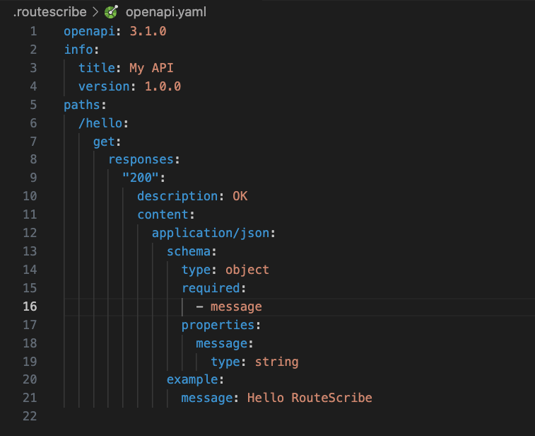

# RouteScribe

Runtime API Intelligence for Express.

Automatically discover your Express APIs from real traffic and generate accurate OpenAPI 3.1 documentation without decorators, annotations, or manually maintained specification files.


[](...)
[](...)
[](...)


> ⚠️ **Alpha**
>
> RouteScribe is under active development. Breaking changes may occur before v1.0.


## Why RouteScribe?
Most API documentation tools require manually maintaining annotations or OpenAPI files.

RouteScribe takes a different approach.

It observes your application at runtime, discovers your API from real requests, and generates OpenAPI documentation automatically.

- No decorators.
- No annotations.
- No duplicated documentation.


## Features

- Express middleware
- Runtime endpoint discovery
- OpenAPI 3.1 generation
- Request & response schema inference
- Path and query parameter detection
- JSON & YAML output
- Zero configuration

RouteScribe continuously improves the generated documentation as your application receives real traffic.


## Quick Start

### 1. Install RouteScribe

```bash
npm install routescribe
```

### 2. Add the RouteScribe middleware

```ts
import express from "express";
import { createRouteScribe } from "routescribe";

const app = express();

app.use(express.json());
app.use(createRouteScribe().middleware());

app.get("/hello", (req, res) => {
  res.json({
    message: "Hello RouteScribe!",
  });
});

app.listen(3000, () => {
  console.log("Server running on http://localhost:3000");
});
```

### 3. Initialize RouteScribe

Generate a configuration file in your project root.

```bash
routescribe init

✓ Created routescribe.config.js
```

You only need to run this once for each project.

This creates:

```text
routescribe.config.js
```


```js
module.exports = {
  title: "My API",
  version: "1.0.0",
  output: ".routescribe",
};
```

### 4. Run your application

Start your Express server as you normally would.

```bash
npm start
```

### 5. Make a few API requests

Use your browser, Postman, curl, or your frontend application to call your API.

For example:

```bash
curl http://localhost:3000/hello
```

RouteScribe observes these requests and responses at runtime and stores the collected metadata.

### 6. Generate the OpenAPI document

Once you've exercised your API, generate the OpenAPI specification.

```bash
routescribe generate

✓ Reading endpoint observations
✓ Generating OpenAPI document
✓ Wrote .routescribe/openapi.json
✓ Wrote .routescribe/openapi.yaml
```

RouteScribe will generate your OpenAPI specification inside:

```text
.routescribe/
├── endpoints.json
├── openapi.json
└── openapi.yaml
```

| File             | Description                                          |
| ---------------- | ---------------------------------------------------- |
| `endpoints.json` | Runtime observations collected from your application |
| `openapi.json`   | Generated OpenAPI 3.1 document                       |
| `openapi.yaml`   | YAML version of the OpenAPI document                 |


## Generated OpenAPI

The generated OpenAPI document is ready to use with tools such as Swagger UI, Redoc, and other OpenAPI-compatible tooling.

<p align="center">
  
</p>


🎉 That's it! Your API has now been documented automatically from real traffic.


## CLI
| Command                | Description                                 |
| ---------------------- | ------------------------------------------- |
| `routescribe init`     | Generate the RouteScribe configuration file |
| `routescribe generate` | Generate OpenAPI JSON and YAML documents    |


## How it works

1. **Observe** incoming requests.
2. **Capture** responses and infer schemas.
3. **Store** runtime observations in `endpoints.json`.
4. **Generate** an OpenAPI 3.1 document.


## Roadmap

- Runtime discovery
- OpenAPI generation
- API diff
- Markdown documentation
- Sequence diagrams
- Runtime intelligence


## Contributing

Contributions, bug reports, and feature requests are welcome.

If you're planning a significant change, please open an issue first so we can discuss the design.


---

If RouteScribe helps your project, consider giving it a ⭐ on GitHub.


## License

MIT © Yuvaan Singh


---

Built with ❤️ for the Express community.